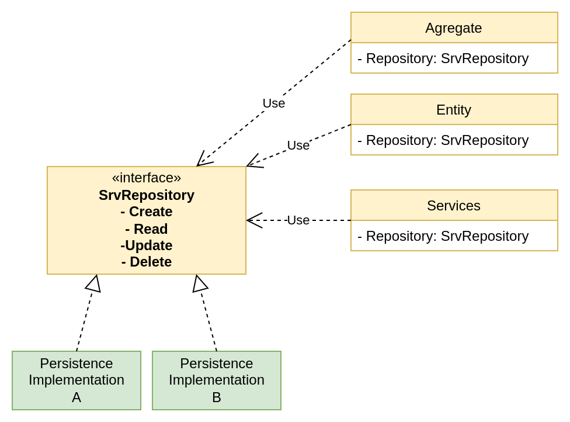
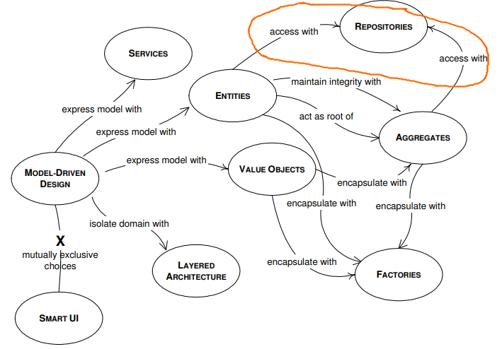

## Repository Pattern.

La preocupación principal del patrón Repository es desacoplar el acceso a datos de
la lógica de dominio, hablando en términos de DDD.
Entonces, la aplicación del patrón nos entrega como lógica de dominio o negocio
totalmente **independiente de las tecnologías** que se utilicen para la lectura
y persistencia de datos.
Esto significa que los objetos de nuestro dominio estarán interactuando con una
**abstracción** de la capa de datos.
De esta forma, nuestro dominio no conoce ningún detalle en cuanto a la
implementación de la infraestructura, lo que permite una clara separación de
responsabilidades, permitiendo que los objetos del dominio tengan como único fin
el implementar lógica de negocio, derivando la responsabilidad de persistencia de
datos hacia cada una de las implementaciones concretas de la capa de datos.

### ¿Cómo luce el patrón Repository?
Básicamente, se trata de una abstracción del sistema de persistencia, es decir, una
interfaz con sus diferentes implementaciones.


* <span style="color:blue">**Dominio**</span>
* <span style="color:green">**Infraestructura**</span>

### ¿Cuál es el valor que aporta?

Cómo vemos, la propuesta es que tanto **Entidades** como **Agregados**, ambos
objetos accedan a los datos comunicándose con el Repository.
Un punto importante a tener en cuenta es que tanto las **Entidades, Agregados y
Repository** son parte de nuestro **Dominio**(color amarillo). Mientras que son
las implementaciones de la interfaz son quienes se encuentran en la capa más
externa, es decir, infraestructura(color verde).
Esto tiene sentido, puesto que es el dominio quién define el contrato que se debe
cumplir, ya que es el dominio quien conoce qué operaciones son necesarias realizar
sobre los datos para finalizar el caso de uso.
No se debe confundir la definición de la Interfaz con la implementación de la Interfaz.



### ¿Cuáles son los beneficios del repository pattern?

El uso de Repository alienta la S de **SOLID**: **Single
Responsibility Principle**. Es decir, que cada *cosa* tenga solo una razón de cambio.
Con responsabilides bien definidas y acotadas.
Un caso de uso acoplado a la infraestructura conlleva a que nuestro dominio tenga que
lidiar con sus propias reglas de negocio y, además, también cargue con la
responsabilidad de operar sobre el sistema de persistencia.
También tengamos en cuenta que en un escenario acoplado a la infraestructura, si
cambiase la forma en que se persisten los datos, afectaría directamente a nuestro
Dominio, teniendo que modificar los casos de uso para adaptarlos a la nueva infraestructura
de capa de datos. Esto es nocivo para el diseño del sistema. Ya que, siguiendo
el enfoque de DDD, las modificaciones en el dominio deberían ser a raíz de cambios
en las reglas de negocio, no a raíz de cambios tecnológicos.

Por otra parte, este patrón también alienta la regla principal de las **Clean
Architectures**: Cuya premisa principal es la separación de la capa de dominio de la
capa de infraestructura.
Asegurando que el dominio no conoce ni lo más mínimo de la infraestructura. Y, de
forma inversa, la infraestructura conoce cada detalle sobre el dominio, tal que, es
la capa exterior quien se acopla a las necesidades de las capas más interiores.
Esto permite que el dominio únicamente se modifique únicamente cuando surjan nuevas
reglas de negocio.
Incluso, dicho patrón se presentó por primera vez en el libro Domain Driven Design
escrito **Eric Evans** y publicado 2004.

Una vez entendida la solución podemos preguntarnos qué valor aporta este patrón
de diseño. Es que nos permite desacoplar el acceso y actualización de datos
del dominio, pero, ¿de qué sirve dicho desacople?
Porque claro está que, en un proyecto productivo, rara vez se cambiaría la base de
datos por una nueva.
¿Entonces, si no está previsto cambiar de base de datos en el futuro,
significa que el patrón no aporta ningún valor? Definitivamente no.
Existe un punto clave que impulsa el uso de repositories en cualquier proyecto:
**Unit Testing**.

Imaginemos que tenemos un **Servicio de dominio** que da de alta nuevos usuarios,
podría llamarse UserRegister por ejemplo.
Ahora bien, este servicio tiene diferentes validaciones (contraseña inválida, nombre
de usuario ya existe, nombre de usuario no válido, email inexistente,
datos obligatorios vacíos, etc). Podríamos realizar los test de este servicio
utilizando una base de datos real, ya sea copia de producción o una base específica
para testing. Cómo sea, deberíamos ocuparnos de actualizar las entradas de las
tablas antes de correr los tests, de forma que cada caso de uso encuentre los
valores correctos en el sistema de persistencia.

Por otro lado, también deberíamos lidiar con la latencia que implica levantar
una base de datos real cada vez que corremos los tests, lo cual impacta de forma
directa en nuestro ciclo de CI/CD.

Analizando este escenario detenidamente, cada vez que agreguemos
un nuevo caso de uso a los tests unitarios, el tiempo de ejecución de los mismos
podría crecer exponencialmente, ya que cada caso de uso posiblemente necesite de
una o varias operaciones CRUD sobre la base de datos.

Este crecimiento en los tiempos de ejecución provoca que introducir una nueva feature
o un simple refactoring se vuelva algo tedioso. Imagine si cada vez que ejecutamos
los tests automáticos tuviéramos que esperar unos cuantos minutos u horas. Sería
un despropósito de recursos para todos.
Pues en proyecto de gran magnitud los test unitarios son gigantes y no deberían
perder tiempo y recursos en levantar, limpiar y actualizar la base de datos.

En todo caso, la implementación concreta de cada base de datos debería testearse
en la capa de infraestructura (**integration tests**) con casos de uso reducidos,
no en la capa de dominio.

Este escenario nos da lugar a utilizar un Repository para operar dentro del
servicio de dominio, utilizando una base de datos en memoria, redis, un array o lo
que se nos ocurra y sea útil para correr los test.

Precisamente ese es el poder del Repository, la **cambiabilidad** que ofrece.
Hoy podríamos estar utilizando un sistema de persistencia A, mañana uno B,
pero a su vez utilizando uno C en el servidor de QA y uno D en el servidor de PRD.
De esta forma se coloca a los sistemas de persistencia en el lugar de "detalle de
implementación", pudiendo usar la base de datos que más se adapta a las necesidades
del proyecto en cada fase del mismo.

### Ejemplo práctico:
Este ejemplo consta de una API que devuelve la cotización del Bitcoin con respecto
a otras monedas no digitales.
Para entregar valores al Cliente, utiliza dos capas de datos:
- Redis implementation in memory.
- Vendor implementation: API pública --> https://api.coindesk.com/v1/bpi/currentprice.json

La particularidad que posee la API es que en función de la hora en la que se
realice la Request, se decide en tiempo de ejecución qué implementación utilizar.

El formato de respuesta es el siguiente:
```json
{
   "bitcoin_price" : {
      "crypto_name" : "Bitcoin",
      "currencies" : [
         {
            "code" : "USD",
            "description" : "United States Dollar",
            "rate" : 30441.5389
         },
         {
            "code" : "EUR",
            "description" : "Euro",
            "rate" : 28306.8565
         },
         {
            "code" : "GBP",
            "description" : "British Pound Sterling",
            "rate" : 24084.1584
         }
      ],
      "updated_at" : "2022-05-30T14:59:45.663265426Z"
   },
   "error" : "",
   "implementation_name" : "Vendor implementation( https://api.coindesk.com/v1/bpi/currentprice.json )"
}
```
Donde ***implementation_name*** devuelve el nombre de quién fué el repository que
obtuvo los datos, donde los valores posibles son dos:
- "implementation_name" : "Vendor implementation( https://api.coindesk.com/v1/bpi/currentprice.json )"
- "implementation_name" : "Redis"

La idea es ir realizando varias Request para, como Cliente, visualizar cómo en
los datos se obtienen de diferentes lugares en función de la hora.

Repasemos los puntos claves de la app:
El servicio de Dominio **_BitcoinSrv_** interactúa con la interfaz
**_BitcoinRepository_**.

```go
type BitcoinRepository interface {
    BitcoinPrice() (error, *BitcoinPrice)
    ImplementationName() (error, string)
}
```

```go
func (b BitcoinSrv) GetBitcoinPrice() *BitcoinResponse {
    err, bitcoinPrice := b.bitcoinRepository.BitcoinPrice()
    err, implementationName := b.bitcoinRepository.ImplementationName() 
	// more code
}
```

Por otra parte, encontramos las implementaciones concretas del repository.
MockBitcoinRepository representa una capa de datos destinada a unit testing. 
Como se vé, solo contiene un registro
```go
type MockBitcoinRepository struct {
	data           *domain.BitcoinPrice
	implementation string
}

func New() domain.BitcoinRepository {
	t := time.Date(2009, time.November, 10, 23, 0, 0, 0, time.UTC)

	return MockBitcoinRepository{
		data: domain.NewBitcoinPrice(t, []domain.Currency{
			{
				Code:        "USD",
				Rate:        29055.3222,
				Description: "United States Dollar",
			},
		}),
		implementation: "Mock_Repository",
	}
}

func (m MockBitcoinRepository) BitcoinPrice() (error, *domain.BitcoinPrice) {
	return nil, m.data
}
```

Luego encontramos aquellas implementaciones utilizadas en la app.

Redis:
```go
type RedisBitcoinRepository struct {
	redisCliente *redis.Client
	ctx          context.Context
	time         time.Time
}

type RedisBitcoinPrice struct {
	UpdatedAt  time.Time
	CryptoName string
	Currencies []domain.Currency
}

func New(host string, port int, db int) (*RedisBitcoinRepository, error) {
	repository := &RedisBitcoinRepository{
		redisCliente: redis.NewClient(&redis.Options{
			Addr:     fmt.Sprintf("%v:%v", host, port),
			Password: "", // no password set
			DB:       db, // use default DB
		}),
		ctx:  context.Background(),
		time: time.Date(2022, time.May, 19, 22, 57, 0, 0, time.UTC),
	}

	BitcoinPrice := domain.NewBitcoinPrice(repository.time, []domain.Currency{
		{
			Code:        "USD",
			Rate:        30185.7069,
			Description: "United States Dollar",
		},
		{
			Code:        "GBP",
			Rate:        24668.4841,
			Description: "British Pound Sterling",
		},
	})

	redisBitcoinPrice := &RedisBitcoinPrice{
		UpdatedAt:  BitcoinPrice.UpdatedAt(),
		CryptoName: BitcoinPrice.CryptoName(),
		Currencies: BitcoinPrice.Currencies(),
	}

	marshalBitcoinPrice, err := json.Marshal(redisBitcoinPrice)
	if err != nil {
		return nil, err
	}

	if _, err := repository.redisCliente.Do(repository.ctx, "set", repository.time.String(), marshalBitcoinPrice).Result(); err != nil {
		return nil, err
	}

	return repository, nil
}

func (r *RedisBitcoinRepository) BitcoinPrice() (error, *domain.BitcoinPrice) {
	result, err := r.redisCliente.Do(r.ctx, "get", r.time.String()).Result()
	if err != nil {
		return err, nil
	}

	strResult, ok := result.(string)
	if !ok {
		return fmt.Errorf("internal Server Error"), nil
	}

	var redisBitcoinPrice RedisBitcoinPrice
	err = json.Unmarshal([]byte(strResult), &redisBitcoinPrice)
	if err != nil {
		return fmt.Errorf("internal Server Error"), nil
	}

	return nil, domain.NewBitcoinPrice(redisBitcoinPrice.UpdatedAt, redisBitcoinPrice.Currencies)
}

func (r RedisBitcoinRepository) ImplementationName() (error, string) {
	return nil, "Redis"
}
```

Vendor:
```go
func NewVendorRepository(endpoint string) *VendorBitcoinRepository {
	return &VendorBitcoinRepository{
		endpoint: endpoint,
	}
}

func (v VendorBitcoinRepository) BitcoinPrice() (error, *domain.BitcoinPrice) {
	resp, err := http.Get(v.endpoint)
	if err != nil {
		return fmt.Errorf("internal server error"), nil
	}

	defer resp.Body.Close()

	var VendorBitcoinPrice VendorBitcoinPrice
	err = json.NewDecoder(resp.Body).Decode(&VendorBitcoinPrice)
	if err != nil {
		if err != nil {
			return fmt.Errorf("internal server error"), nil
		}
	}

	bitcoinPrice, err := v.newBitcoinPrice(VendorBitcoinPrice)
	if err != nil {
		return err, nil
	}

	return nil, bitcoinPrice
}

func (v VendorBitcoinRepository) newBitcoinPrice(price VendorBitcoinPrice) (*domain.BitcoinPrice, error) {

	bitcoinPrice := domain.NewBitcoinPrice(time.Now(), []domain.Currency{
		{
			Code:        price.Bpi.USD.Code,
			Rate:        price.Bpi.USD.RateFloat,
			Description: price.Bpi.USD.Description,
		},
		{
			Code:        price.Bpi.EUR.Code,
			Rate:        price.Bpi.EUR.RateFloat,
			Description: price.Bpi.EUR.Description,
		},
		{
			Code:        price.Bpi.GBP.Code,
			Rate:        price.Bpi.GBP.RateFloat,
			Description: price.Bpi.GBP.Description,
		},
	})

	return bitcoinPrice, nil
}

func (v VendorBitcoinRepository) ImplementationName() (error, string) {
	return nil, fmt.Sprintf("Vendor implementation( %v )", v.endpoint)
}
```

Por último, pero no menos importante, encontramos una Factory cuya responsabilidad
es instanciar los repository necesarios y devolver el indicado en función de la
hora actual del servidor.

```go
func (b BitcoinRepositoryFactory) Repository() domain.BitcoinRepository {
	if b.test {
		return b.mockRepository
	}

	t := time.Now()
	switch t.Unix() % 2 {
	case 0:
		return b.redisRepository
	default:
		return b.vendorRepository
	}
}
```

### Instalación
- Dependencias: Docker & Docker-compose.

```shell
git clone https://github.com/rcrespodev/Blogs/tree/main/design/repository
```

Build image
```shell
sudo docker build -t repository_pattern:latest .
```

El commando
```shell
docker image ls -f reference=repository_pattern:latest
``` 
debería mostrar un output similar al siguiente:
```shell
REPOSITORY           TAG       IMAGE ID       CREATED         SIZE
repository_pattern   latest    09a179937fae   7 minutes ago   522MB
```

Run app in container:
```shell
docker compose up -d
```

Consume app:
```shell
curl 0.0.0.0:8080/bitcoin-price | json_pp
```
Output:
```shell
  % Total    % Received % Xferd  Average Speed   Time    Time     Time  Current
                                 Dload  Upload   Total   Spent    Left  Speed
100   410  100   410    0     0   1000      0 --:--:-- --:--:-- --:--:--   997
{
   "bitcoin_price" : {
      "crypto_name" : "Bitcoin",
      "currencies" : [
         {
            "code" : "USD",
            "description" : "United States Dollar",
            "rate" : 30441.5389
         },
         {
            "code" : "EUR",
            "description" : "Euro",
            "rate" : 28306.8565
         },
         {
            "code" : "GBP",
            "description" : "British Pound Sterling",
            "rate" : 24084.1584
         }
      ],
      "updated_at" : "2022-05-30T14:59:45.663265426Z"
   },
   "error" : "",
   "implementation_name" : "Vendor implementation( https://api.coindesk.com/v1/bpi/currentprice.json )"
}
```

Run tests in local:
```shell
make tests
```